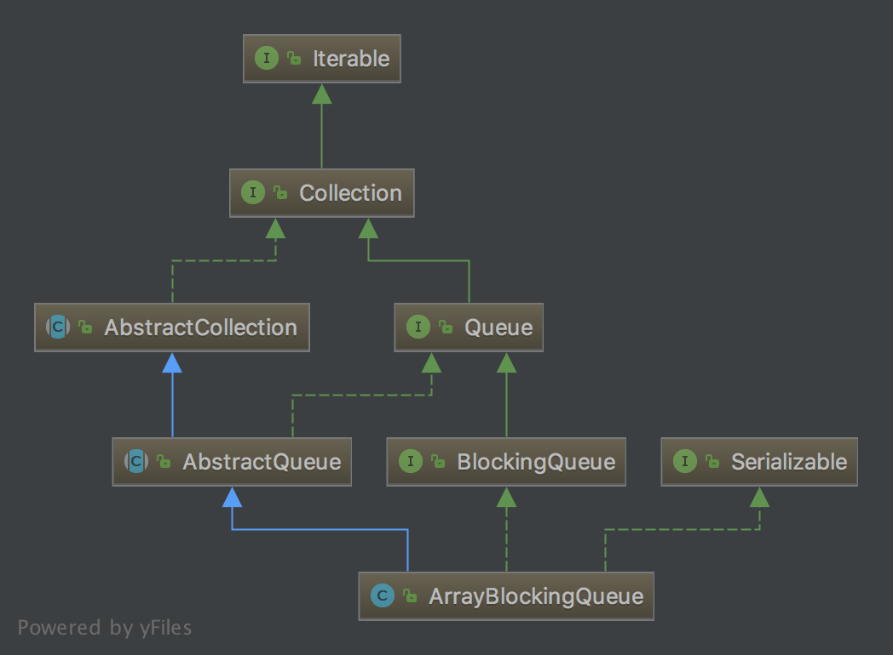

# ArrayBlockingQueue

## UML
ArrayBlockingQueue继承自`AbstractQueue`，是`java.util.concurrent.BlockingQueue`以及`java.io.Serializable`的实现类。



## 特性
ArrayBlockingQueue的head是在队列中时间最长的元素，tail是时间最短的元素，遵循FIFO原则。这是一个典型的bounded buffer（有限缓冲），也就是说生产者负责插入元素，消费者负责释放元素。如果试图从一个满的队列中插入数据，或从空队列中提取数据，都会导致操作阻塞。注意，ArrayBlockingQueue的大小不可被随意改变。

## Constants
```java
 /**
     * Serialization ID. This class relies on default serialization
     * even for the items array, which is default-serialized, even if
     * it is empty. Otherwise it could not be declared final, which is
     * necessary here.
     */
    private static final long serialVersionUID = -817911632652898426L;

    /** The queued items */
    final Object[] items;

    /** items index for next take, poll, peek or remove */
    int takeIndex;

    /** items index for next put, offer, or add */
    int putIndex;

    /** Number of elements in the queue */
    int count;

    /*
     * Concurrency control uses the classic two-condition algorithm
     * found in any textbook.
     */

    /** Main lock guarding all access */
    final ReentrantLock lock;

    /** Condition for waiting takes */
    private final Condition notEmpty;

    /** Condition for waiting puts */
    private final Condition notFull;

    /**
     * Shared state for currently active iterators, or null if there
     * are known not to be any.  Allows queue operations to update
     * iterator state.
     */
    transient Itrs itrs;
 ```
ArrayBLockingQueue的底层是数组`final Object[] items;`。

## 构造器
```java
public ArrayBlockingQueue(int capacity) {
        this(capacity, false);
    }

    public ArrayBlockingQueue(int capacity, boolean fair) {
        if (capacity <= 0)
            throw new IllegalArgumentException();
        this.items = new Object[capacity];
        lock = new ReentrantLock(fair);
        notEmpty = lock.newCondition();
        notFull =  lock.newCondition();
    }

    public ArrayBlockingQueue(int capacity, boolean fair,
                              Collection<? extends E> c) {
        this(capacity, fair);

        final ReentrantLock lock = this.lock;
        lock.lock(); // Lock only for visibility, not mutual exclusion
        try {
            final Object[] items = this.items;
            int i = 0;
            try {
                for (E e : c)
                    items[i++] = Objects.requireNonNull(e);
            } catch (ArrayIndexOutOfBoundsException ex) {
                throw new IllegalArgumentException();
            }
            count = i;
            putIndex = (i == capacity) ? 0 : i;
        } finally {
            lock.unlock();
        }
    }
```
这里可以通过capacity指定队列大小，通过`boolean fair`指定是否使用公平锁。同时还可以把集合`Collection<? extends E> c`直接转为队列。

## enqueue & dequeue
```java
/**
     * Inserts element at current put position, advances, and signals.
     * Call only when holding lock.
     */
    private void enqueue(E e) {
        // assert lock.isHeldByCurrentThread();
        // assert lock.getHoldCount() == 1;
        // assert items[putIndex] == null;
        final Object[] items = this.items;
        items[putIndex] = e;
        if (++putIndex == items.length) putIndex = 0;
        count++;
        notEmpty.signal();
    }

    /**
     * Extracts element at current take position, advances, and signals.
     * Call only when holding lock.
     */
    private E dequeue() {
        // assert lock.isHeldByCurrentThread();
        // assert lock.getHoldCount() == 1;
        // assert items[takeIndex] != null;
        final Object[] items = this.items;
        @SuppressWarnings("unchecked")
        E e = (E) items[takeIndex];
        items[takeIndex] = null;
        if (++takeIndex == items.length) takeIndex = 0;
        count--;
        if (itrs != null)
            itrs.elementDequeued();
        notFull.signal();
        return e;
    }
```
这里是入队以及出队的方法，分别使用`putIndex`以及`takeIndex`表示插入位置以及取出位置。当索引为队列大小时，设为0.

## 阻塞插入put

```java
public void put(E e) throws InterruptedException {
        Objects.requireNonNull(e);
        final ReentrantLock lock = this.lock;
        lock.lockInterruptibly();
        try {
            while (count == items.length)
                notFull.await();
            enqueue(e);
        } finally {
            lock.unlock();
        }
    }
```
首先检查e是否为空，接着加锁。ArrayBlockingQueue中插入和取出是用的一把锁。所以无法在插入时执行取出。当队列长度达到上限，触发notFull让当前线程挂起执行等待。当notFull满足条件时，执行enqueue。

## 阻塞取出take
```java
public E take() throws InterruptedException {
        final ReentrantLock lock = this.lock;
        lock.lockInterruptibly();
        try {
            while (count == 0)
                notEmpty.await();
            return dequeue();
        } finally {
            lock.unlock();
        }
    }
```
这里操作与put相似。