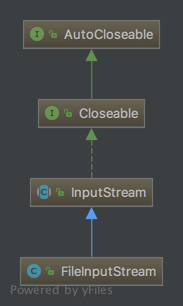

# FileInputStream

FileInputStream可以将文件中的数据转换成流。

## UML
FileInputStream继承InputStream


## Variables
```java
/* File Descriptor - handle to the open file */
    private final FileDescriptor fd;

    /**
     * The path of the referenced file
     * (null if the stream is created with a file descriptor)
     */
    private final String path;

    private volatile FileChannel channel;

    private final Object closeLock = new Object();

    private volatile boolean closed;

    private final AltFinalizer altFinalizer;
```
FileDescriptor是一个File或者是Socket的接收器。以FD表示文件来说，可以通俗的讲FileDescriptor看作文件，但不能直接使用FileDescriptor操作文件，必须转换成FileOutPutStream后在进行操作。

## 构造器
```java
public FileInputStream(String name) throws FileNotFoundException {
        this(name != null ? new File(name) : null);
    }

public FileInputStream(File file) throws FileNotFoundException {
        String name = (file != null ? file.getPath() : null);
        SecurityManager security = System.getSecurityManager();
        if (security != null) {
            security.checkRead(name);
        }
        if (name == null) {
            throw new NullPointerException();
        }
        if (file.isInvalid()) {
            throw new FileNotFoundException("Invalid file path");
        }
        fd = new FileDescriptor();
        fd.attach(this);
        path = name;
        open(name);
        altFinalizer = AltFinalizer.get(this);
        if (altFinalizer == null) {
            fd.registerCleanup();         // open set the fd, register the cleanup
        }
    }

    public FileInputStream(FileDescriptor fdObj) {
        SecurityManager security = System.getSecurityManager();
        if (fdObj == null) {
            throw new NullPointerException();
        }
        if (security != null) {
            security.checkRead(fdObj);
        }
        fd = fdObj;
        path = null;
        altFinalizer = null;

        /*
         * FileDescriptor is being shared by streams.
         * Register this stream with FileDescriptor tracker.
         */
        fd.attach(this);
    }
```

源码注释中说到通常会抛出三种异常：
1. FileNotFoundException：如果文件不存在，或path为一个文件夹时抛出；
2. SecurityException：没有权限访问时抛出；
3. NullPointerException：当参数为空时抛出；

这里fd.attach(this)关联FileDescriptor实例和FileInputStream实例，是为了关闭FileDescriptor作准备。
关于FileDescriptor的代码日后再详细解析。
```java
synchronized void attach(Closeable c) {
        //codes

    }
```

AltFinalizer是定义在FileInputStream中的一个静态类，当FIS没有被引用时，就会生成此实例，并关闭流。这里就暂时不贴出代码了。

## open
```java
    private native void open0(String name) throws FileNotFoundException;

    private void open(String name) throws FileNotFoundException {
        open0(name);
    }
 ```
open方法可以打开文件并形成流，这里的open0调用了JVM里的方法。

## available
```java
public int available() throws IOException {
        return available0();
    }

    private native int available0() throws IOException;
```
available返回一个流中可以被阅读的字节数（原文：**an estimate of the number of remaining bytes that can be read (or skipped over) from this input stream without blocking.**

## others
当然除了上述方法，FIS继承了InputStream的其他方法，如read，skip等。
FIS还有一个FileChannel对象，这里是NIO中的引用，在此暂不详细说明。