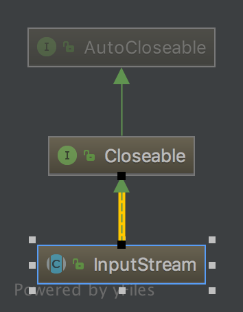

# InputSteam

## UML图
InputSteam本身实现了Closeable接口，Closeable接口又继承了AutoCloseable接口，其中只含有一个void close()方法，用于关闭资源，并释放与其相关的所有的潜在的资源。



## constants
```java
 private static final int MAX_SKIP_BUFFER_SIZE = 2048;

 private static final int DEFAULT_BUFFER_SIZE = 8192;
```
## read
InputStream.read;
```java
public abstract int read() throws IOException;
```
首先所有InputStream的子类在使用read方法时，都要重写它。通过注释可以知道，read返回数据的byte值（范围：0～255），如果没有接近stream结束时，会返回-1.
```java
public int read(byte b[]) throws IOException {
        return read(b, 0, b.length);
    }
```
```java
public int read(byte b[], int off, int len) throws IOException {
        Objects.requireNonNull(b);
        Objects.checkFromIndexSize(off, len, b.length);
        if (len == 0) {
            return 0;
        }

        int c = read();
        if (c == -1) {
            return -1;
        }
        b[off] = (byte)c;

        int i = 1;
        try {
            for (; i < len ; i++) {
                c = read();
                if (c == -1) {
                    break;
                }
                b[off + i] = (byte)c;
            }
        } catch (IOException ee) {
        }
        return i;
    }
```
read(byte b[], int off, int len)可以读取从off到off + len的所有数据，并且返回bytes的数量，注意方法中首先使用Objects.requireNonNull和Objects.checkFromIndexSize检查了byte[]是否为空或者越界.可以学习一波

## readAllBytes
InputStream.readAllBytes();
```java
public byte[] readAllBytes() throws IOException {
        byte[] buf = new byte[DEFAULT_BUFFER_SIZE];
        int capacity = buf.length;
        int nread = 0;
        int n;
        for (;;) {
            // read to EOF which may read more or less than initial buffer size
            while ((n = read(buf, nread, capacity - nread)) > 0)
                nread += n;

            // if the last call to read returned -1, then we're done
            if (n < 0)
                break;

            // need to allocate a larger buffer
            if (capacity <= MAX_BUFFER_SIZE - capacity) {
                capacity = capacity << 1;
            } else {
                if (capacity == MAX_BUFFER_SIZE)
                    throw new OutOfMemoryError("Required array size too large");
                capacity = MAX_BUFFER_SIZE;
            }
            buf = Arrays.copyOf(buf, capacity);
        }
        return (capacity == nread) ? buf : Arrays.copyOf(buf, nread);
    }
```
这里首先试着读取流中的数据，如果一次读完，跳出循环，且nread一定会等于capacity；若没有，则需要进行扩容.
这里首先判断扩为原来两倍后是否会小于MAX Size，如果是，则capacity右移；如果不是，则将capacity直接设为MAX Size，返回最新的buf。

## readBytes
InputStream.readBytes(bytes[] b, int off, int len);
```java
public int readNBytes(byte[] b, int off, int len) throws IOException {
        Objects.requireNonNull(b);
        Objects.checkFromIndexSize(off, len, b.length);

        int n = 0;
        while (n < len) {
            int count = read(b, off + n, len - n);
            if (count < 0)
                break;
            n += count;
        }
        return n;
    }

```

## skip
```java
public long skip(long n) throws IOException {

        long remaining = n;
        int nr;

        if (n <= 0) {
            return 0;
        }

        int size = (int)Math.min(MAX_SKIP_BUFFER_SIZE, remaining);
        byte[] skipBuffer = new byte[size];
        while (remaining > 0) {
            nr = read(skipBuffer, 0, (int)Math.min(size, remaining));
            if (nr < 0) {
                break;
            }
            remaining -= nr;
        }

        return n - remaining;
    }
```
skip方法可以跳过流中n个bytes的数据，使用的方法其实是把这n个byte提前read过去。返回值是真正跳过的数量。

## transferTo
```java
public long transferTo(OutputStream out) throws IOException {
        Objects.requireNonNull(out, "out");
        long transferred = 0;
        byte[] buffer = new byte[DEFAULT_BUFFER_SIZE];
        int read;
        while ((read = this.read(buffer, 0, DEFAULT_BUFFER_SIZE)) >= 0) {
            out.write(buffer, 0, read);
            transferred += read;
        }
        return transferred;
    }
```
将InputStream转为OutputStream，返回值为真正转换的数量。